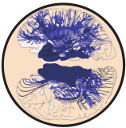

 

# encodingmotor 
#### (Repository version 0.1.1)
EEG measures of neural processing reflect human visaual encoding and motor preparation time (encodingmotor).

**Authors: Michael D. Nunez, Kitty K. Lui, Kiana A. Scambray, Joachim Vandekerckhove, and Ramesh Srinivasan from the Cognitive Sciences Department at the University of California, Irvine**

### Research Questions

Many common models of speeded decision-making assume that cognitive processing required occurs in three sequential time periods: 1) a period of visual encoding, 2) a period of decision-making, and then 3) a period of motor response time. Our goal is to find estimates of these three time periods in milliseconds for each subject using a mixture of human behavior observations (choice and reaction time) and evoked electroencephalographic (EEG) measures. 

### Hypotheses

1) Non-decision times for each session of data, as estimated by drift-diffusion models of accuracy and reaction time distributions, will have a 1-to-1 linear relationship with N200 negative peak latency time (an event-related potential possibly reflecting visual encoding time)
2) Non-decision times for each session of data, as estimated by drift-diffusion models of accuracy and reaction time distributions, will have a 1-to-1 linear relationship with motor response time as estimated by the time of the peak beta band-desynchronization (14-18 Hz) before response.

### Prerequisites

[MATLAB](https://www.mathworks.com/)

[MATLAB Repository: artscreenEEG](https://github.com/mdnunez/artscreenEEG)

[MCMC Sampling Program: JAGS](http://mcmc-jags.sourceforge.net/)

[Program: JAGS Wiener module](https://sourceforge.net/projects/jags-wiener/)

[Scientific Python libraries](https://www.continuum.io/downloads)

[Python Repository: pyjags](https://github.com/tmiasko/pyjags)

### Downloading

The repository can be cloned with `git clone https://github.com/mdnunez/encodingmotor.git`

The repository can also be may download via the _Download zip_ button above.

### Installation

After downloading/unzipping the repository, users will need to add these functions to the MATLAB path. In MATLAB, add the repository to the PATH with

```matlab
%Set 'artloc' to full directory path
emloc = 'C:\Users\MATLAB\encodingmotor';
addpath(genpath(emloc));
```

### License

encodingmotor is licensed under the GNU General Public License v3.0 and written by Michael D. Nunez, Joachim Vandekerckhove, and Ramesh Srinivasan from the Cognitive Sciences Department at the University of California, Irvine.

### Further Reading

Nunez, M. D., Gosai, A., Vandekerckhove, J., & Srinivasan, R. (2019).
[The latency of a visual evoked potential tracks the onset of decision making.](https://www.researchgate.net/publication/332630466_The_latency_of_a_visual_evoked_potential_tracks_the_onset_of_decision_making) NeuroImage. doi: 10.1016/j.neuroimage.2019.04.052


Lui, K. K., Nunez, M. D., Cassidy, J. M., Vandekerckhove, J., Cramer, S. C., & Srinivasan, R. (2018).
[Timing of readiness potentials reflect a decision-making process in the human brain.](https://www.biorxiv.org/content/early/2018/06/04/338806) bioRxiv. doi: 10.1101/338806

Nunez, M. D., Vandekerckhove, J., & Srinivasan, R. (2017).
[How attention influences perceptual decision making: Single-trial EEG correlates of drift-diffusion model parameters.](https://www.researchgate.net/publication/298275031_How_attention_influences_perceptual_decision_making_Single-trial_EEG_correlates_of_drift-diffusion_model_parameters)
Journal of Mathematical Psychology, 76, 117-130.

